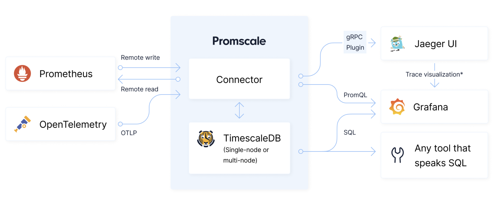

> **Warning**
>
> Promscale has been discontinued and is deprecated.
>
> The code in this repository is no longer maintained.
>
> [Learn more](https://github.com/timescale/promscale/issues/1836).


# Promscale

[](https://github.com/timescale/promscale/actions?query=workflow%3AGo)
[](https://github.com/timescale/promscale/actions?query=workflow%3A%22reviewdog+-+golangci%22)
[](https://goreportcard.com/report/github.com/timescale/promscale)
[]()
[](https://pkg.go.dev/github.com/timescale/promscale)

- **[Website](https://www.timescale.com/promscale)**
- **[Install](https://docs.timescale.com/promscale/latest/installation/)**
- **[Docs](https://docs.timescale.com/promscale/latest/)**
- **[Slack Community](https://timescaledb.slack.com/)** (join the #promscale channel)
- **[Forum](https://www.timescale.com/forum/c/promscale-and-observability)**
- **[Blog](https://blog.timescale.com/tag/observability/)**


**Promscale is a unified metric and trace observability backend for Prometheus,
Jaeger and OpenTelemetry built on PostgreSQL and TimescaleDB.**

Promscale serves as a robust and 100% PromQL-compliant Prometheus remote storage and as a durable and scalable 
Jaeger storage backend. Promscale is a certified Jaeger storage backend.

Unlike other observability backends, it has a simple and easy-to-manage architecture 
with just two components: the Promscale Connector and the Promscale Database (PostgreSQL with the
TimescaleDB and Promscale extensions).

## Quick Start

**Try it out now** with our demo environment you can deploy on your laptop in five minutes with Docker.

```bash
git clone https://github.com/timescale/promscale.git
cd promscale/docker-compose/promscale-demo
docker compose up -d
```
Explore your metrics and traces in Grafana (http://localhost:3000, username: admin, password: admin) and
Jaeger (http://localhost:16686).

Check our short [demo guide](https://docs.timescale.com/promscale/latest/quick-start/) to learn more.

## Key Features

* **Prometheus metric storage:** support for remote write, remote read, 100% PromQL, metric metadata,
exemplars and Prometheus HA.
* **Certified Jaeger trace storage:** Promscale is a [certified Jaeger storage backend](https://github.com/jaegertracing/jaeger#multiple-storage-backends).
Integrate Jaeger with Promscale to store and visualize your traces with a simple configuration change in Jaeger.
Use Promscale as the storage backend for the metrics required by the
[Service Performance Management UI](https://www.jaegertracing.io/docs/1.38/spm/). No need for a separate 
Prometheus / PromQL compatible storage.
* **OpenTelemetry trace storage:** support for ingestion of traces through the OpenTelemetry Protocol
(OTLP).
* **Grafana integration:** query and visualize your metrics and traces using the PromQL, SQL and Jaeger
datasources.
* **Durable and reliable storage:** built on top of the maturity of Postgres and TimescaleDB with 
millions of instances worldwide. A trusted system that offers high availability, replication, 
data integrity, data compression, backups, authentication, roles and permissions.
* **PromQL Alerts:** full support for PromQL alerting rules. You can reuse the Prometheus configuration
that you already have.
* **Multi-tenancy:** support for Prometheus multi-tenancy so you can restrict data access by tenant.
* **Pick your query language:** PromQL for metrics and SQL for metrics and traces. With full SQL
support together with TimescaleDB's advanced analytics functions, you can query and correlate metrics,
traces, and business data to derive new insights.
* **Flexible data management:** configurable default retention for metrics and traces as well as
per-metric retention and APIs to delete metric series that are no longer needed.
* **Downsampling:** increase the performance of long-term queries by downsampling metrics with PromQL recording
rules and TimescaleDB continuous aggregates. Combine downsampling with per-metric retention to only keep the 
data you need, reduce costs and accelerate performance.
* **Out-of-the-box monitoring:** leverage the dashboard, alerting rules and runbooks built by the Promscale
team to start monitoring Promscale since the first day following best practices from the team behind the
product.
* **Easy data migration:** use our [prom-migrator](https://github.com/timescale/promscale/blob/master/migration-tool/cmd/prom-migrator/README.md)
tool to effortlessly migrate your existing Prometheus data to Promscale.
* **Simplified deployment on K8s:** use [tobs](https://github.com/timescale/tobs) to deploy and manage a complete,
pre-configured and production-ready observability stack for metrics and traces on a K8s cluster that includes
Promscale, Prometheus, OpenTelemetry with auto-instrumentation, Grafana and plenty of out-of-the-box dashboards and alerts.

## Architecture

[Learn more](https://docs.timescale.com/promscale/latest/about-promscale/#promscale-schema-for-metric-data) 
about Promscale's architecture and how it works.



## Promscale for Prometheus

Promscale provides Prometheus users with:

* **A single-pane-of-glass across all Kubernetes clusters**<br/>
Use Promscale as a centralized storage for all your Prometheus instances
so you can easily query data across all of them in Grafana and centralize
[alert management](https://docs.timescale.com/promscale/latest/alert/) and
[recording rules](https://docs.timescale.com/promscale/latest/downsample-data/recording/).
Use [multi-tenancy](https://docs.timescale.com/promscale/latest/scale-ha/prometheus-multi-tenancy/)
to control who has access to the data for a Kubernetes cluster.

* **Efficient long-term trend analysis**<br/>
Use Promscale as a durable long-term storage for Prometheus metrics with a proven and rock-solid 
foundation based on PostgreSQL and TimescaleDB with millions of instances worldwide. With
[metric downsampling](https://docs.timescale.com/promscale/latest/downsample-data/)
and [per-metric retention](https://docs.timescale.com/promscale/latest/manage-data/retention/#configure-data-retention-for-metrics)
you can keep just the data you need for your analysis for as long as you need. This allows you
to cut down the costs associated with using the same retention for all data in Prometheus and
dramatically improves query performance for long-term queries.

**Key features**: [100% PromQL-compliant](https://promlabs.com/promql-compliance-test-results/2021-10-14/promscale/),
high availability, multi-tenancy, PromQL alerting and recording rules, downsampling, per-metric retention.

If you are already familiar with PostgreSQL, then Promscale is a great choice for
your Prometheus remote storage. You can scale to millions of series and hundreds
of thousands of samples per second on a single PostgreSQL node thanks to TimescaleDB.

To get started:
1. [Install Promscale](https://docs.timescale.com/promscale/latest/installation/#install-promscale-with-instrumentation).
2. [Configure Prometheus](https://docs.timescale.com/promscale/latest/send-data/prometheus/) to send data to Promscale.
3. [Configure Grafana](https://docs.timescale.com/promscale/latest/visualize-data/grafana/) to query and visualize metrics from Promscale
using a PromQL and/or a PostgreSQL datasource.

## Promscale for Jaeger and OpenTelemetry

Promscale supports ingesting Jaeger and OpenTelemetry traces via the Jaeger Collector and the OpenTelemetry Collector.
OpenTelemetry traces can also be sent directly from OpenTelemetry client libraries via the OpenTelemetry Protocol (OTLP).
Promscale is a certified Jaeger storage that passess 100% of the compliance tests.

Promscale provides Jaeger and OpenTelemetry users with:

* **An easy-to-use durable and scalable storage backend for traces**<br/>
Most users run Jaeger with the in memory or badger storage because the two options recommended for production
(Elasticsearch and Cassandra) are difficult to set up and operate. Promscale uses a much simpler architecture
based on PostgreSQL which many developers are comfortable with and scales to 100s of thousands of spans per
second on a single database node. 

* **Service performance analysis**<br/>
Because Promscale can store both metrics and traces, you can use the new 
[Service Performance Management](https://www.jaegertracing.io/docs/1.36/spm/) feature in Jaeger with Promscale 
as the only storage backend for the entire experience.
Promscale also includes a fully customizable, out-of-the-box, and modern
[Application Performance Management (APM) experience](https://docs.timescale.com/promscale/latest/visualize-data/apm-experience/)
in Grafana built using SQL queries on traces.

* **Trace analysis**<br/>
Jaeger searching capabilities are limited to filtering individual traces. This is helpful when troubleshooting problems once you know
what you are looking for. With Promscale you can use SQL to interrogate your trace data in any way you want and discover issues
that would usally take you a long time to figure out by just looking at log lines, metric charts or individual traces. You can see some
examples in [our documentation](https://docs.timescale.com/promscale/latest/query-data/query-traces/) and in
[this blog post](https://www.timescale.com/blog/what-are-traces-and-how-sql-yes-sql-and-opentelemetry-can-help-us-get-more-value-out-of-traces-to-build-better-software/)

**Key features:** native OTLP support, high availability, SQL queries, APM capabilities, data compression, data retention

**Try it out** by installing our lightweight [opentelemetry-demo](https://github.com/timescale/opentelemetry-demo) with a single
command. Check [this blog post](https://www.timescale.com/blog/learn-opentelemetry-tracing-with-this-lightweight-microservices-demo/)
for more details.

To get started:
1. [Install Promscale](https://docs.timescale.com/promscale/latest/installation/#install-promscale-with-instrumentation).
2. [Send traces to Promscale](https://docs.timescale.com/promscale/latest/send-data/) in Jaeger, OpenTelemetry, or Zipkin format
3. [Configure Jaeger](https://docs.timescale.com/promscale/latest/visualize-data/jaeger/) to query and visualize traces from Promscale.

Also consider:

4. [Configure Grafana](https://docs.timescale.com/promscale/latest/visualize-data/grafana) to query and visualize traces from Promscale
using a Jaeger and a PostgreSQL datasource.
5. [Install the APM dashboards](https://docs.timescale.com/promscale/latest/visualize-data/apm-experience/) in Grafana.

## Documentation and Help

Complete user documentation is available at https://docs.timescale.com/promscale/latest/

If you have any questions, please join the #promscale channel on
[TimescaleDB Slack](https://slack.timescale.com/).

## Promscale Repositories

This repository contains the source code of the Promscale Connector. Promscale also requires that the Promscale extension
which lives in [this repository](https://github.com/timescale/promscale_extension) is installed in the TimescaleDB/PostgreSQL
database. The extension sets up and manages the database schemas and provides performance and SQL query experience improvements.

This repository also contains the source code for **prom-migrator**. **Prom-migrator** is
an **open-source**, **community-driven** and **free-to-use**, **universal prometheus
data migration tool**, that migrates data from one storage system to another, leveraging Prometheus's
remote storage endpoints. For more information about prom-migrator, visit
[prom-migrator's README](https://github.com/timescale/promscale/blob/master/migration-tool/cmd/prom-migrator/README.md).

You may also want to check [tobs](https://github.com/timescale/tobs) which makes it very easy to deploy a complete
observability stack built on Prometheus, OpenTelemetry and Promscale in Kubernetes via helm.

## Contributing

We welcome contributions to the Promscale Connector, which is
licensed and released under the open-source Apache License, Version 2.
The same [Contributor's
Agreement](https://github.com/timescale/timescaledb/blob/master/CONTRIBUTING.md)
applies as in TimescaleDB; please sign the [Contributor License
Agreement](https://cla-assistant.io/timescale/promscale)
(CLA) if you're a new contributor.

## Release

Release checklist is available when creating new ["Release Checklist" issue](https://github.com/timescale/promscale/issues/new?template=release.md).
