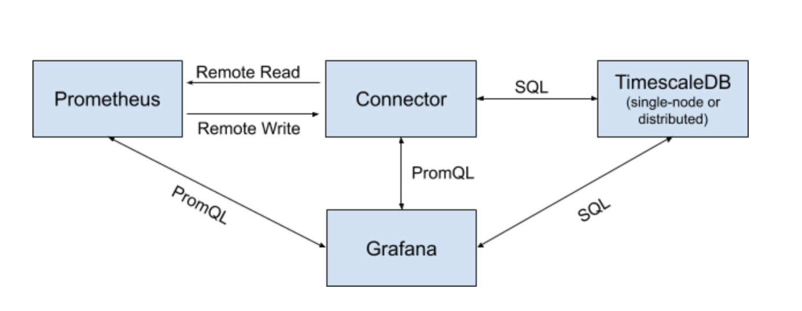

# Timescale-Prometheus

[](https://github.com/timescale/timescale-prometheus/actions?query=workflow%3AGo)
[](https://github.com/timescale/timescale-prometheus/actions?query=workflow%3A%22reviewdog+-+golangci%22)
[](https://goreportcard.com/report/github.com/timescale/timescale-prometheus)
[](https://codeclimate.com/github/timescale/timescale-prometheus/maintainability)
[](https://pkg.go.dev/github.com/timescale/timescale-prometheus)

This project connects Prometheus to TimescaleDB, creating an
**analytical and long-term storage platform for Prometheus metrics**.



This platform is **horizontally-scalable**, **highly-compressed**, and
**operationally mature**. By allowing a user to use SQL, in addition to
PromQL, this platform empowers the user to ask complex analytical
queries from their metrics data, and thus extract more meaningful
insights.

For a detailed description of this architecture, please see [our design
doc][design-doc].

If you have any questions, please join the #prometheus channel on
[TimescaleDB Slack](https://slack.timescale.com/), or the
[Timescale-Prometheus Users Google Group](https://groups.google.com/forum/#!forum/timescale-prometheus-users).

## 🐯 About TimescaleDB

**[TimescaleDB](https://github.com/timescale/timescaledb)** is a
**distributed time-series database built on PostgreSQL** that scales to
over 10 million of metrics per second, supports native compression,
handles high cardinality, and offers native time-series capabilities,
such as data retention policies, continuous aggregate views,
downsampling, data gap-filling and interpolation.

TimescaleDB also supports full SQL, a variety of data types (numerics,
text, arrays, JSON, booleans), and ACID semantics. Operationally mature
capabilities include high-availability, streaming backups, upgrades over
time, roles and permissions, and security.

TimescaleDB has a **large and active user community** (tens of millions
of downloads, hundreds of thousands of active deployments, Slack channel
with 4,000+ members). Users include Comcast, Fujitsu,
Schneider Electric, Siemens, Walmart, Warner Music, and thousands of
others.

Developers and organizations around the world trust TimescaleDB with their
time-series data. AppDynamics (now part of Cisco Systems and one of the
largest application performance monitoring providers) relies on TimescaleDB
as its main metrics database. TimescaleDB is also the preferred (recommended)
backend datasource for Zabbix users and is natively supported in Grafana.

## 🔧 Choose your own (installation) adventure

We have four main ways to set up Timescale-Prometheus:

### tobs (recommended for Kubernetes environments)

[The Observability Suite for Kubernetes][tobs] is a
CLI tool and Helm chart that makes installing a full observability suite into your
Kubernetes cluster really easy. Tobs includes Prometheus, TimescaleDB,
Timescale-Prometheus Connector, and Grafana.

To get started, run the following in your terminal, then follow the on-screen instructions.

```bash
curl --proto '=https' --tlsv1.2 -sSLf  https://tsdb.co/install-tobs-sh |sh
```

Or visit the [tobs GitHub repo][tobs] for more information and instructions
on advanced configuration.

### 🐳 Docker

We provide [docker images](/releases) with every release.

Instructions on how to use our docker images are available [here](docs/docker.md).

### 🔟 Binaries

We have [pre-packaged binaries](/releases) available for MacOS and Linux on both the x86_64 and i386 architectures.
Instructions on how to use our prepackaged binaries are available [here](docs/binary.md).

You can also [build binaries from source](docs/binary.md#building-from-source).

### ⎈ Helm (sub)chart for Timescale-Prometheus Connector only

A Helm chart for only the Timescale-Prometheus Connector is available in
the [helm-chart directory](helm-chart/README.md) of this repository.

This is used as a Helm dependency from the `tobs`
[Helm chart](https://github.com/timescale/tobs/tree/master/chart) and can be used as a dependency in your own custom Helm chart as well.

## 🔍 Analyzing the data using SQL

We describe how to use our pre-defined views and functions to work with the prometheus data in [the SQL schema doc](docs/sql_schema.md).

A Reference for our SQL API is [available here](docs/sql_api.md).

## 💡 Quick tips

### Configuring Data Retention

By default, data is stored for 90 days and then deleted. This
default can be changed globally or overridden for individual
metrics.

If using tobs, these settings can be changed using the
`tobs metrics retention` command (use
`tobs metrics retention -h` to see all options).

These setting can also be changed using the appropriate
[SQL commands](docs/sql_schema.md#data-retention).

### 🌐 Prometheus HTTP API

The Timescale-Prometheus Connector can be used directly as a Prometheus Data
Source in Grafana, or other software.

The connector implements some endpoints of the currently stable (V1) [Prometheus HTTP
API](https://prometheus.io/docs/prometheus/latest/querying/api). The API is
accessible at `http://<timescale_prometheus_connector_address>:9201/api/v1` and can be
used to execute instant or range PromQL queries against the data in
TimescaleDB, as well as retrieve the metadata for series, label names and
label values.

A Reference for the implemented endpoints of the Prometheus HTTP API is [available here](docs/prometheus_api.md)

### Configuring Prometheus to filter which metrics are sent (optional)

You can limit the metrics being sent to the adapter (and thus being
stored in your long-term storage) by setting up `write_relabel_configs`
in Prometheus, via the `prometheus.yml` file.
Doing this can reduce the amount of space used by your database and thus
increase query performance.

The example below drops all metrics starting with the prefix `go_`,
which matches Golang process information exposed by exporters like
`node_exporter`:

```yaml
remote_write:
 - url: "http://timescale_prometheus_connector:9201/write"
   write_relabel_configs:
      - source_labels: [__name__]
        regex: 'go_.*'
        action: drop
```

Additional information about setting up relabel configs, the
`source_labels` field, and the possible actions can be found in the
[Prometheus Docs](https://prometheus.io/docs/prometheus/latest/configuration/configuration/#remote_write).

[design-doc]: https://tsdb.co/prom-design-doc
[tobs]: https://github.com/timescale/tobs