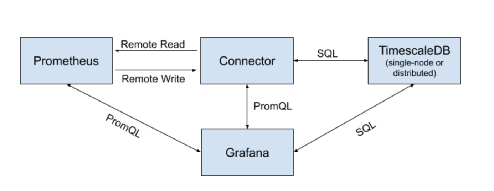

# Prometheus HTTP API reference

The [Prometheus HTTP API](https://prometheus.io/docs/prometheus/latest/querying/api/) defines endpoints
for executing PromQL expression queries (instant and range), query metadata about the series and labels, retrieve 
information about alerts, targets and the complete configuration of the prometheus server. 

We implemented the endpoints for executing PromQL and labels metadata to allow the Timescale-Prometheus connector to be 
used as a Prometheus compatible data-source in applications like Grafana. 

When requesting a query to run on data that is in the long-term storage through Prometheus, the query goes through the 
following steps. 
1. Query engine requests the data through the remote_read protocol;
1. The connector translates the request to SQL statement with only a time range and label matchers applied;
1. The database returns almost raw data;
1. The connector marshals it into a format compatible with the remote_read protocol;
1. The Query engine combines the local and remote data and applies any functions or aggregations before returning a 
result.

By having the Connector implement the PromQL APIs, the connector can:
1. Parse the PromQL and translate it to a SQL statement that with a time range, label matchers, calculations and 
aggregates to be pushed down;
1. The database executes the query;
1. A modified Prometheus Query Engine finalizes the calculation and marshals the data to a proper response.

By using the Connector for PromQL queries directly a network trip is avoided, and TimescaleDB is better utilized to 
actually perform some calculations. 

## Implemented Endpoints

|                 Name               |              Endpoint                   |                          Description                      | 
|------------------------------------|-----------------------------------------|-----------------------------------------------------------|
|[Instant Queries][instant-queries]  |`GET /api/v1/query``POST /api/v1/query`  |Evaluate an instant query at a single point in time        |
|[Range Queries][range-queries]      |`GET /api/v1/query_range``POST /api/v1/query_range`|Evaluate an expression query over a range of time|
|[Label Names][label-names]          |`GET /api/v1/labels``POST /api/v1/labels`|Return a list of label names                               |
|[Label Values][label-values]        |`GET /api/v1/label/<label_name>/values`  |Return a list of label values for a provided label name    |

[instant-queries]: (https://prometheus.io/docs/prometheus/latest/querying/api/#instant-queries)
[range-queries]: (https://prometheus.io/docs/prometheus/latest/querying/api/#range-queries)
[label-names]: (https://prometheus.io/docs/prometheus/latest/querying/api/#getting-label-names)
[label-values]: (https://prometheus.io/docs/prometheus/latest/querying/api/#querying-label-values)